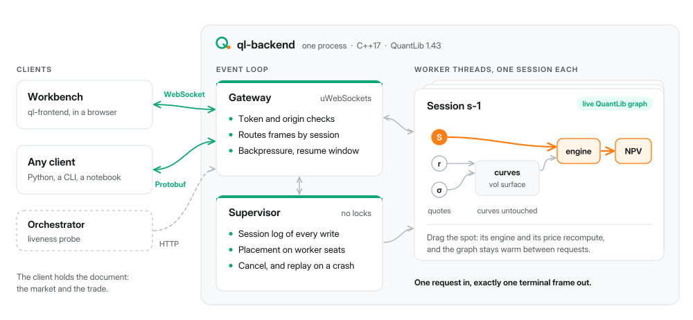

<p align="center">
  <picture>
    <source media="(prefers-color-scheme: dark)" srcset="assets/logo/logo-dark.svg">
    
  </picture>
</p>

# Interactive QuantLib Service (Backend)

A stateful C++ pricing backend for interactive derivatives pricing, built on
[QuantLib](https://www.quantlib.org/). A client opens a session over a
WebSocket; the server keeps that session's QuantLib object graph alive between
requests, so moving one quote reprices only the instruments that depend on it.
That is what lets a spot slider in a UI feel immediate instead of rebuilding
every curve on every keystroke.

The wire format is Protobuf: one request frame in, exactly one terminal reply
frame out — including for failures and cancellations.

<p align="center">
  <picture>
    <source media="(prefers-color-scheme: dark)" srcset="assets/architecture/architecture-dark.svg">
    
  </picture>
</p>

## What it does today

- **Prices options** across eight payoffs, three exercises and ten styles,
  reaching 49 compiled engines — analytic, lattice, finite-difference,
  integral and Monte Carlo — with quanto composing over the other styles
  rather than duplicating them.
- **Reprices incrementally.** A quote write invalidates only the affected
  instruments; a single frame can sweep a quote across a ladder of values.
- **Reports progress and cancels.** A long Monte Carlo streams progress and
  stops on request, leaving its session alive.
- **Survives a dropped connection** for a 60-second window, work in flight
  included, via `ResumeSession`.
- **Says what it supports.** A `Hello` frame answers with this build's
  capabilities as data, so a client never has to probe.

Anything in the schema that this build does not price is rejected by name —
never quietly substituted.

## Correctness

`test/smoke_v2.py` prices **369 rows of QuantLib's own published reference
values** over the wire, each within the tolerance QuantLib's test suite uses
for it. The rows are extracted from the library's `test-suite/*.cpp` by a
checked-in generator rather than transcribed by hand. The suite also
cross-checks the analytic quanto barriers against a PDE, and finds one of
QuantLib's three recorded values not reproducible.

## Quick start

Needs CMake ≥ 3.16, a C++17 compiler, Boost headers, and Protobuf with its
CMake package config. On macOS: `brew install cmake boost protobuf`.

```bash
git clone https://github.com/markccchiang/ql-backend.git
cd ql-backend
git submodule update --init --recursive                     # schema, uWebSockets
git submodule update --init --checkout --depth 1 third_party/QuantLib
cmake -S . -B build -DQLBACKEND_VENDOR_QUANTLIB=ON -Wno-dev
cmake --build build -j
./build/ql-backend --port 9111
```

This route builds QuantLib from the pinned submodule, which is slow the first
time but cannot be misconfigured — the service needs a QuantLib built with
`QL_ENABLE_SESSIONS`, and linking one without it produces wrong numbers rather
than an error. [`doc/INSTALL.md`](doc/INSTALL.md) explains both routes and the
failures that are silent.

## Documentation

Full documentation lives in [`doc/`](doc/index.md). Every page is Markdown and
reads as it is on GitHub; Sphinx turns the set into a searchable site with a
sidebar, rendered maths and the diagrams drawn.

```bash
python3 -m venv .venv
.venv/bin/pip install -r doc/requirements.txt          # sphinx, rtd theme, myst
sh doc/build.sh                                        # English, then Traditional Chinese

open doc/_build/html/index.html                        # macOS
xdg-open doc/_build/html/index.html                    # Linux
```

`doc/build.sh` writes English to `doc/_build/html/` and Traditional Chinese to
`doc/_build/html/zh-tw/`, with a switch in the sidebar that keeps you on the
same page. `make -C doc html` builds the English alone once `sphinx-build` is
on your `PATH` — after `source .venv/bin/activate`, say. Everything lands in
`doc/_build/`, which is gitignored, and the build is clean: any warning is a
real broken reference.

The English Markdown is the source, and the Chinese lives in gettext
catalogues under `doc/locale/zh_TW/LC_MESSAGES/`, one per page. When the English
changes, refresh them; changed paragraphs come back marked `#, fuzzy` and new
ones come back empty, and an untranslated string falls back to English rather
than breaking the page:

```bash
.venv/bin/python -m sphinx -b gettext doc doc/_build/gettext
(cd doc && ../.venv/bin/sphinx-intl update -p _build/gettext -l zh_TW)
```

| Page | What it covers |
| --- | --- |
| [Overview](doc/index.md) | Status, the file map, and what is not built yet |
| [Install](doc/INSTALL.md) | Prerequisites, both build routes, and what fails silently |
| [Design](doc/DESIGN.md) | The architecture, and the QuantLib constraint forcing each decision |
| [API](doc/api/connecting.md) | Writing a client: connecting, bindings, a first price, recipes |
| [Handlers](doc/HANDLERS.md) | Every frame the service accepts, with a worked client session |
| [Testing](doc/TESTING.md) | Running the end-to-end suite and regenerating the reference tables |
| [Benchmark](doc/BENCHMARK.md) | The quanto barrier cross-check against a PDE |
| [Mathematics](doc/maths/index.md) | The formulas behind every number, and where each one lives in QuantLib |

The wire schema is a separate repository,
[ql-protobuf](https://github.com/markccchiang/ql-protobuf), mounted here as
the `proto` submodule so a frontend can consume it without cloning this one.

## Status

It runs and it prices. What is missing is the process boundary: workers are
threads inside the gateway process today, so a cancel that has to *kill* a
running calculation can only disown it. The design for fork/exec workers, and
what that buys, is in [`doc/DESIGN.md`](doc/DESIGN.md) §3.

## License

[MIT](LICENSE) — free to use, copy, modify and distribute, including
commercially, as long as the copyright notice comes along.

That covers the code in this repository. The submodules keep their own
licences: [QuantLib](https://github.com/lballabio/QuantLib) is under a
modified BSD licence and [uWebSockets](https://github.com/uNetworking/uWebSockets)
under Apache 2.0, both of which permit this use; the wire schema is
[ql-protobuf](https://github.com/markccchiang/ql-protobuf), licensed
separately.
